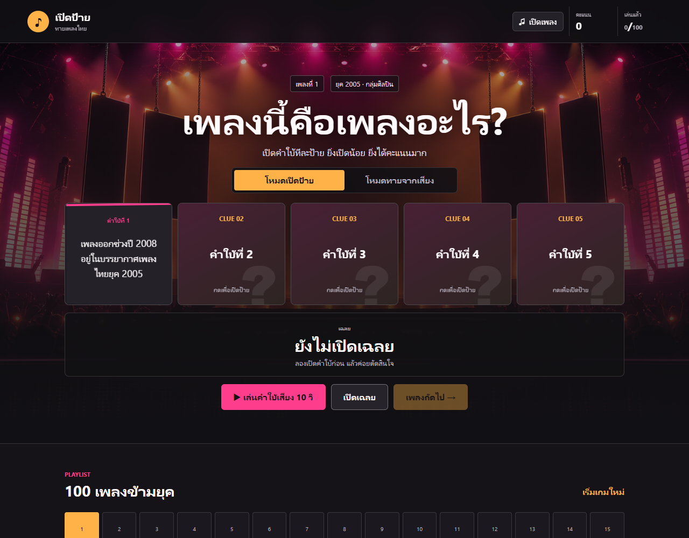
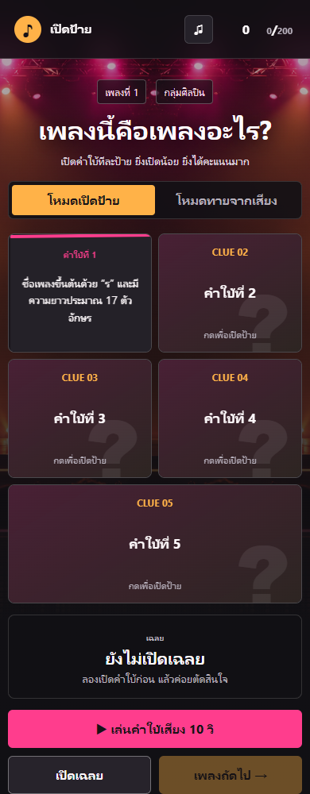
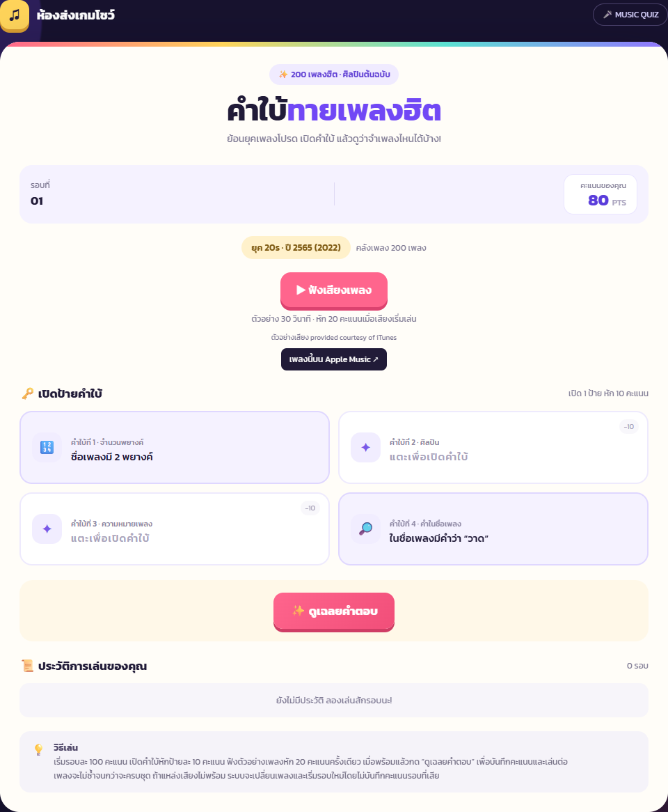
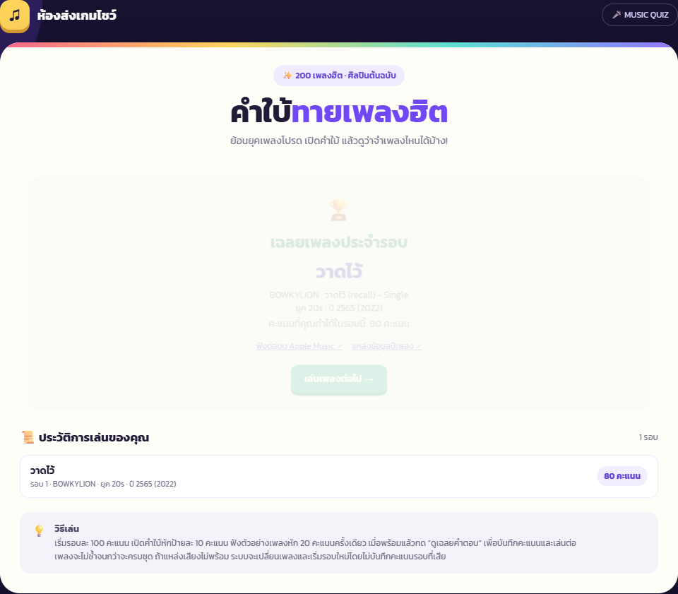
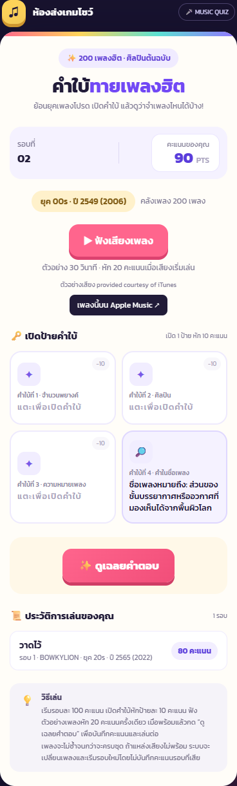
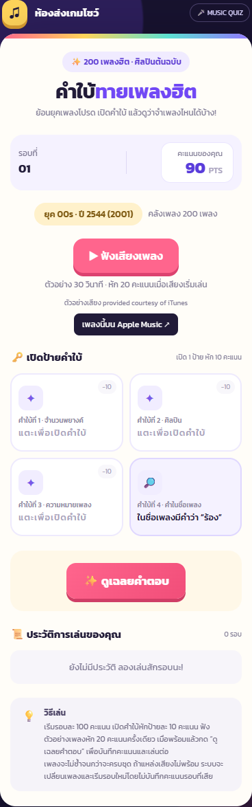
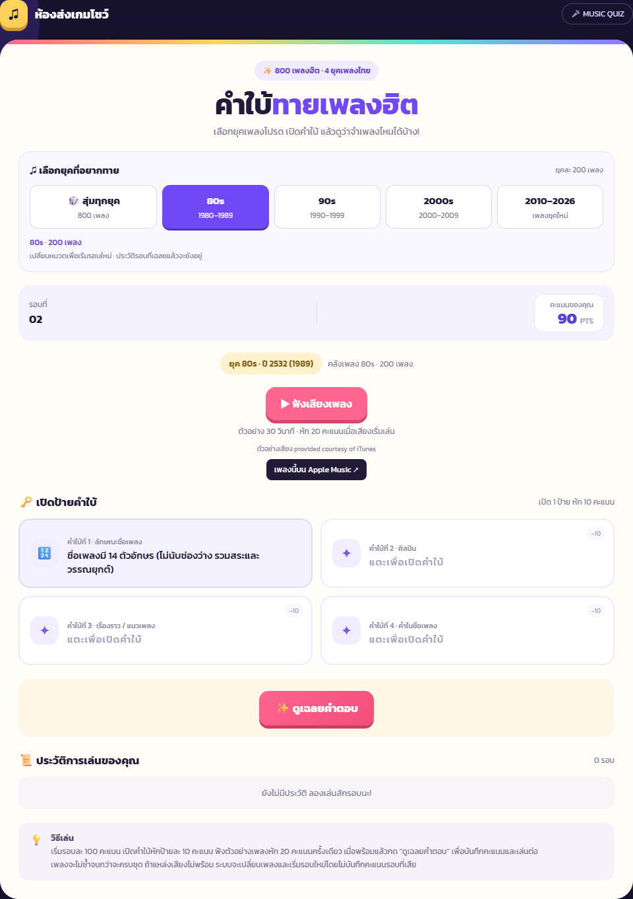
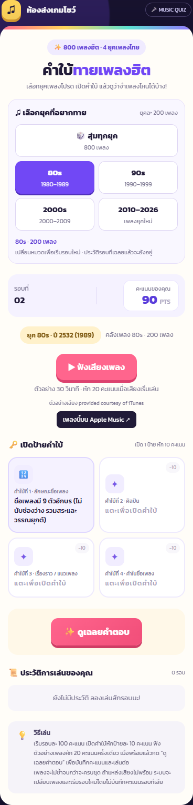
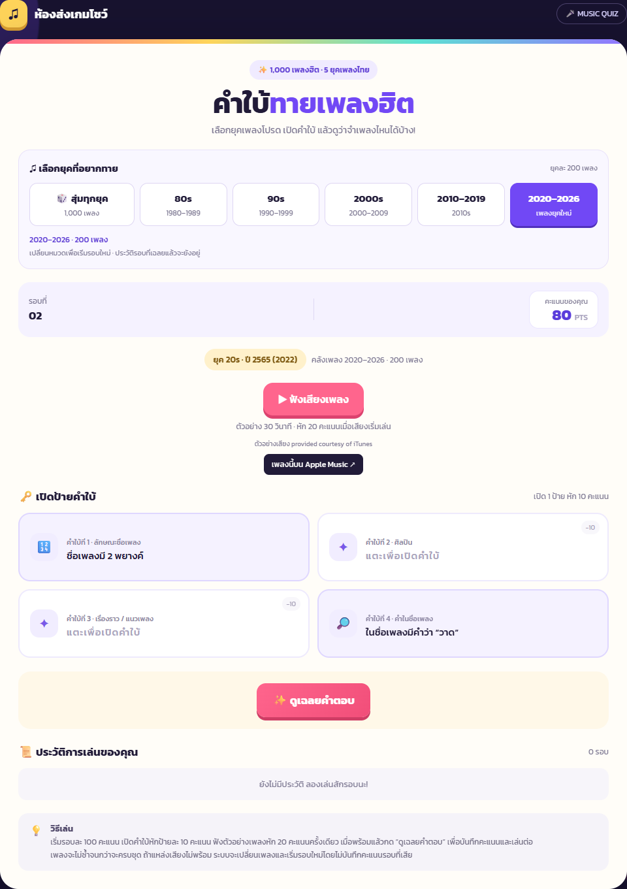
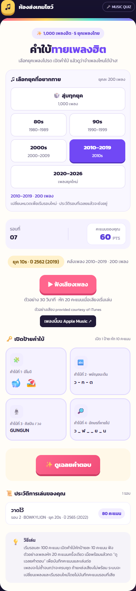

# ภาพแต่ละช่วงการพัฒนา GuessTheSongs

[รายงานหลัก](Prompt-Log-GuessTheSongs.md) · [สารบัญเอกสาร](README.md) · [เปิดเกมปัจจุบัน](https://thai-song-quiz-two.vercel.app/)

ภาพย้อนหลัง 11 ภาพ: กู้ไฟล์ภาพเดิมจาก Git 5 ภาพ และถ่ายภาพใหม่จากโค้ดเก่า 6 ภาพ ภาพถ่ายใหม่เป็นการสาธิตหน้าจอในวันนี้ ไม่ใช่ภาพที่ถ่ายระหว่างพัฒนาในวันเดิม ใช้โค้ดเก่าตามแหล่งอ้างอิงโดยไม่แก้ข้อมูลหรือหน้าตา และเปิดป้าย/เลือกเพลงเพื่อประกอบภาพ

หน้าตาเดิม 100/200 เพลงมาจากประวัติ Git ที่รวมเข้ามาก่อนหน้านี้ จึงแยกจากรอบ Prompt ในรายงาน ไม่อนุมานว่าคือภาพของรอบ 1–5 ซึ่งไม่มี snapshot แยกแต่ละรอบ วันที่ที่อ้าง commit คือวันที่บันทึก Git ไม่ใช่การยืนยันวันถ่ายภาพเดิม

| ช่วงการพัฒนา | หลักฐาน | ประเภทภาพ |
| --- | --- | --- |
| หน้าตาเดิมในประวัติ Git — 100 และ 200 เพลง | [f670c6d](https://github.com/Xenz2207/thai-song-quiz/commit/f670c6d9eb0f5551735e0595f51abe3b0fe1bc50) | ถ่ายใหม่จากโค้ดเก่าใน Git |
| หน้าตาใหม่ 200 เพลง — ภาพเดิมที่บันทึกไว้ใน Git | [8c93e05](https://github.com/Xenz2207/thai-song-quiz/commit/8c93e055ac4a5c6c08986283b86336e6424f0a58) | ภาพเดิมกู้จาก Git |
| เปรียบเทียบก่อนและหลังแก้คำใบ้รอบ 7 | [8c93e05](https://github.com/Xenz2207/thai-song-quiz/commit/8c93e055ac4a5c6c08986283b86336e6424f0a58) | ถ่ายใหม่จากโค้ดเก่าใน Git |
| รอบ 8 — หมวดเพลงและคลัง 800 เพลง | สำเนา local ก่อนแยกยุค; ไม่มี Git tag ของช่วงนี้ | ถ่ายใหม่จากสำเนาโค้ดช่วง 800 เพลง |
| รอบ 9 — v1.1.0 แบ่ง 5 ยุค รวม 1,000 เพลง | [774a479](https://github.com/Xenz2207/thai-song-quiz/commit/774a47918f01abb83c1873faef99f21ac1010d45) | ภาพเดิมกู้จาก Git |

รายละเอียดที่มา SHA-256 และขนาดภาพอยู่ใน [manifest.json](images/history/manifest.json)

### หน้าตาเดิมในประวัติ Git — 100 และ 200 เพลง





### หน้าตาใหม่ 200 เพลง — ภาพเดิมที่บันทึกไว้ใน Git







### เปรียบเทียบก่อนและหลังแก้คำใบ้รอบ 7




### รอบ 8 — หมวดเพลงและคลัง 800 เพลง





### รอบ 9 — v1.1.0 แบ่ง 5 ยุค รวม 1,000 เพลง




## รุ่นปัจจุบัน — v1.2.0



ภาพปัจจุบันอื่น ๆ อยู่ในภาคผนวก 3.1 ของรายงานหลัก

## สร้างภาพย้อนหลังอีกครั้ง

```sh
node scripts/capture-history-images.cjs
node scripts/render-report.cjs
```

สคริปต์กู้ไฟล์ภาพจาก commit เดิมและแยกโค้ดเก่าไว้ใน `.report-work/history-snapshots/` โดยไม่เปลี่ยน checkout ปัจจุบัน ภาพช่วง 800 เพลงใช้สำเนา local `.catalog-work/expanded/app-before-split.html` ซึ่งไม่มี commit แยก; ส่ง path สำเนานี้เป็น argument ได้ หากไม่พบไฟล์ สคริปต์คงภาพ 800 เพลงที่เก็บไว้แล้วและตรวจ SHA-256 ตาม manifest แทน
